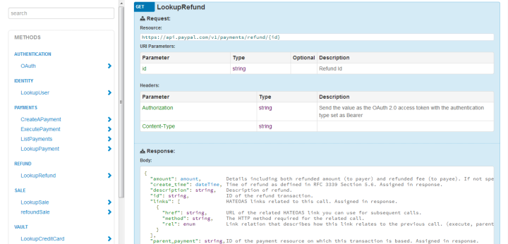

ApiDoc's documentation
======================

Summary
-------

ApiDoc is a API documentation generator built with Python.
It is developed by Jérémy Derussé and `SFR Business Team <http://www.sfrbusinessteam.fr>`_.

ApiDoc consists of a command line interface. It is maintained in a single repository.
By using this application you automatically require all of the necessary modules dependencies which are:

Requirements
------------

For core application

* PyYAML
* Jinja2
* JsonSchema

For developers who want to contribute code to ApiDoc

* behave
* coverage
* mock
* nose

Contents
--------

.. toctree::
   :maxdepth: 2

   quickstart
   usage
   config
   source
   contributing
   todo

Licenses
--------

ApiDoc uses the following projects:

`Twitter Bootstrap <http://twitter.github.com/bootstrap>`_

`Jquery <http://jquery.org/>`_

`Icon Minia <http://dribbble.com/shots/598215-Icon-Minia-139-Vector-Icons>`_

`Entypo <http://www.entypo.com/>`_

`IcoMoon <http://keyamoon.com/icomoon/>`_
